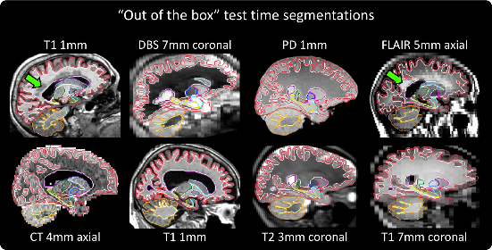
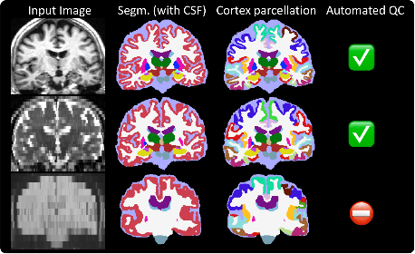
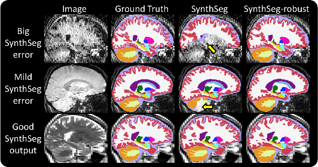
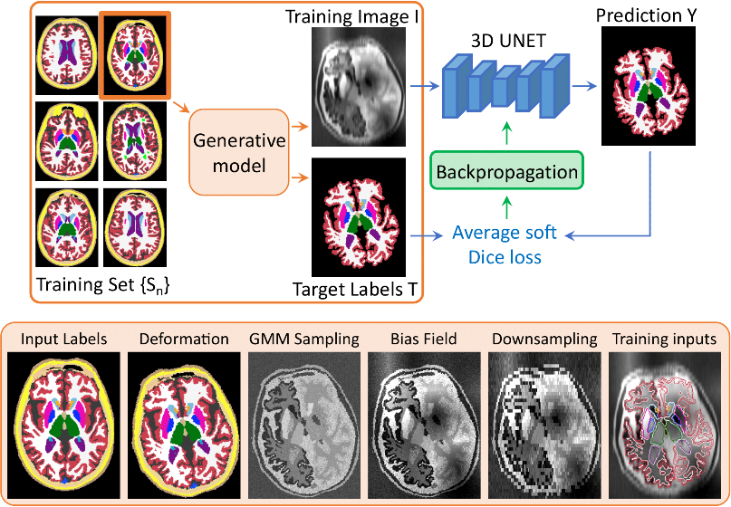
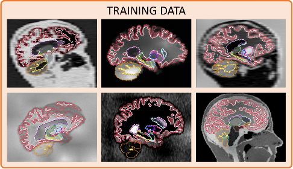

# SynthSeg


In this repository, we present SynthSeg, the first deep learning tool for segmentation of brain scans of
any contrast and resolution. SynthSeg works out-of-the-box without any retraining, and is also robust to:
- a wide array of populations: from young and healthy to ageing and diseased,
- scans with or without preprocessing: bias field correction, skull stripping, normalisation, etc.
- white matter lesions.
\
\



\
SynthSeg was first presented for the automated segmentation of brain scans of any contrast and resolution.

**SynthSeg: Segmentation of brain MRI scans of any contrast and resolution without retraining** \
B. Billot, D.N. Greve, O. Puonti, A. Thielscher, K. Van Leemput, B. Fischl, A.V. Dalca, J.E. Iglesias \
Medical Image Analysis (2023) \
[ [article](https://www.sciencedirect.com/science/article/pii/S1361841523000506) | [arxiv](https://arxiv.org/abs/2107.09559) | [bibtex](bibtex.bib) ]
\
\
Then, we extended it to work on heterogeneous clinical scans, and to perform cortical parcellation and automated 
quality control.

**Robust machine learning segmentation for large-scale analysisof heterogeneous clinical brain MRI datasets** \
B. Billot, M. Colin, Y. Cheng, S.E. Arnold, S. Das, J.E. Iglesias \
PNAS (2023) \
[ [article](https://www.pnas.org/doi/full/10.1073/pnas.2216399120#bibliography) | [arxiv](https://arxiv.org/abs/2203.01969) | [bibtex](bibtex.bib) ]

\
Here, we distribute our model to enable users to run SynthSeg on their own data. We emphasise that 
predictions are always given at 1mm isotropic resolution (regardless of the input resolution). The code can be run on
the GPU (~15s per scan) or on the CPU (~1min).


----------------

### New features and updates

\
01/03/2023: **The papers for SynthSeg and SynthSeg 2.0 are out! :open_book: :open_book:** \
After a long review process for SynthSeg (Medical Image Analysis), and a much faster one for SynthSeg 2.0 (PNAS), both
papers have been accepted nearly at the same time ! See the references above, or in the citation section.

\
04/10/2022: **SynthSeg is available with Matlab!** :star: \
We are delighted that Matlab 2022b (and onwards) now includes SynthSeg in its Medical Image
Toolbox. They have a [documented example](https://www.mathworks.com/help/medical-imaging/ug/Brain-MRI-Segmentation-Using-Trained-3-D-U-Net.html)
on how to use it. But, to simplify things, we wrote our own Matlab wrapper, which you can call in one single line. 
Just download [this zip file](https://liveuclac-my.sharepoint.com/:u:/g/personal/rmappmb_ucl_ac_uk/EctEe3hOP8dDh1hYHlFS_rUBo80yFg7MQY5WnagHlWcS6A?e=e8bK0f),
uncompress it, open Matlab, and type `help SynthSeg` for instructions.

\
29/06/2022: **SynthSeg 2.0 is out !** :v: \
In addition to whole-brain segmentation, it now also performs **Cortical parcellation, automated QC, and intracranial 
volume (ICV) estimation** (see figure below). Also, most of these features are compatible with SynthSeg 1.0. (see table).
\
\



\
01/03/2022: **Robust version** :hammer: \
SynthSeg sometimes falters on scans with low signal-to-noise ratio, or with very low tissue contrast. For this reason, 
we developed a new model for increased robustness, named "SynthSeg-robust". You can use this mode when SynthSeg gives 
results like in the figure below:
\
\


\
29/10/2021: **SynthSeg is now available on the dev version of
[FreeSurfer](https://surfer.nmr.mgh.harvard.edu/fswiki/DownloadAndInstall) !!** :tada: \
See [here](https://surfer.nmr.mgh.harvard.edu/fswiki/SynthSeg) on how to use it.

----------------

### Try it in one command !

Once all the python packages are installed (see below), you can simply test SynthSeg on your own data with:
```
python ./scripts/commands/SynthSeg_predict.py --i <input> --o <output> [--parc --robust --ct --vol <vol> --qc <qc> --post <post> --resample <resample>]
```


where:
- `<input>` path to a scan to segment, or to a folder. This can also be the path to a text file, where each line is the
path of an image to segment.
- `<output>` path where the output segmentations will be saved. This must be the same type as `<input>` (i.e., the path 
to a file, a folder, or a text file where each line is the path to an output segmentation).
- `--parc` (optional) to perform cortical parcellation in addition to whole-brain segmentation.
- `--robust` (optional) to use the variant for increased robustness (e.g., when analysing clinical data with large space
spacing). This can be slower than the other model.
- `--ct` (optional) use on CT scans in Hounsfield scale. It clips intensities to [0, 80].
- `<vol>` (optional) path to a CSV file where the volumes of all segmented regions will be saved for all scans 
(e.g. /path/to/volumes.csv). If `<input> ` is a text file, so must be `<vol>`, for which each line is the path to a 
different CSV file corresponding to one subject only.
- `<qc>` (optional) path to a CSV file where QC scores will be saved. The same formatting requirements apply as for
`<vol>`.
- `<post>` (optional) path where the posteriors, given as soft probability maps, will be saved (same formatting 
requirements as for `<output>`).
- `<resample>` (optional) SynthSeg segmentations are always given at 1mm isotropic resolution. Hence, 
images are always resampled internally to this resolution (except if they are already at 1mm resolution). 
Use this flag to save the resampled images (same formatting requirements as for `<output>`).

Additional optional flags are also available:
- `--cpu`: (optional) to enforce the code to run on the CPU, even if a GPU is available.
- `--threads`: (optional) number of threads to be used by Tensorflow (default uses one core). Increase it to decrease 
the runtime when using the CPU version.
- `--crop`: (optional) to crop the input images to a given shape before segmentation. This must be divisible by 32.
Images are cropped around their centre, and their segmentations are given at the original size. It can be given as a 
single (i.e., `--crop 160`), or several integers (i.e, `--crop 160 128 192`, ordered in RAS coordinates). By default the
whole image is processed. Use this flag for faster analysis or to fit in your GPU.
- `--fast`: (optional) to disable some operations for faster prediction (twice as fast, but slightly less accurate). 
This doesn't apply when the --robust flag is used.
- `--v1`: (optional) to run the first version of SynthSeg (SynthSeg 1.0, updated 29/06/2022).


**IMPORTANT:** SynthSeg always give results at 1mm isotropic resolution, regardless of the input. However, this can 
cause some viewers to not correctly overlay segmentations on their corresponding images. In this case, you can use the
`--resample` flag to obtain a resampled image that lives in the same space as the segmentation, such that they can be 
visualised together with any viewer.

The complete list of segmented structures is available in [labels table.txt](data/labels%20table.txt) along with their
corresponding values. This table also details the order in which the posteriors maps are sorted.


----------------

### Installation

1. Clone this repository.

2. Create a virtual environment (i.e., with pip or conda) and install all the required packages. \
These depend on your python version, and here we list the requirements for Python 3.6 
([requirements_3.6](requirements_python3.6.txt)) and Python 3.8 (see [requirements_3.8](requirements_python3.8.txt)).
The choice is yours, but in each case, please stick to the exact package versions.\
A first solution to install the dependencies, if you use pip, is to run setup.py (with and activated virtual 
environment): `python setup.py install`. Otherwise, we also give here the minimal commands to install the required 
packages using pip/conda for Python 3.6/3.8.

```
# Conda, Python 3.6:
conda create -n synthseg_36 python=3.6 tensorflow-gpu=2.0.0 keras=2.3.1 h5py==2.10.0 nibabel matplotlib -c anaconda -c conda-forge

# Conda, Python 3.8:
conda create -n synthseg_38 python=3.8 tensorflow-gpu=2.2.0 keras=2.3.1 nibabel matplotlib -c anaconda -c conda-forge

# Pip, Python 3.6:
pip install tensorflow-gpu==2.0.0 keras==2.3.1 nibabel==3.2.2 matplotlib==3.3.4

# Pip, Python 3.8:
pip install tensorflow-gpu==2.2.0 keras==2.3.1 protobuf==3.20.3 numpy==1.23.5 nibabel==5.0.1 matplotlib==3.6.2
```

3. Go to this link [UCL dropbox](https://liveuclac-my.sharepoint.com/:f:/g/personal/rmappmb_ucl_ac_uk/EtlNnulBSUtAvOP6S99KcAIBYzze7jTPsmFk2_iHqKDjEw?e=rBP0RO), and download the missing models. Then simply copy them to [models](models).

4. If you wish to run on the GPU, you will also need to install Cuda (10.0 for Python 3.6, 10.1 for Python 3.8), and 
CUDNN (7.6.5 for both). Note that if you used conda, these were already automatically installed.

That's it ! You're now ready to use SynthSeg ! :tada:


----------------

### How does it work ?

In short, we train a network with synthetic images sampled on the fly from a generative model based on the forward
model of Bayesian segmentation. Crucially, we adopt a domain randomisation strategy where we fully randomise the 
generation parameters which are drawn at each minibatch from uninformative uniform priors. By exposing the network to 
extremely variable input data, we force it to learn domain-agnostic features. As a result, SynthSeg is able to readily 
segment real scans of any target domain, without retraining or fine-tuning. 

The following figure first illustrates the workflow of a training iteration, and then provides an overview of the 
different steps of the generative model:
\
\

\
\
Finally we show additional examples of the synthesised images along with an overlay of their target segmentations:
\
\

\
\
If you are interested to learn more about SynthSeg, you can read the associated publication (see below), and watch this
presentation, which was given at MIDL 2020 for a related article on a preliminary version of SynthSeg (robustness to
MR contrast but not resolution).
\
\
[](https://www.youtube.com/watch?v=Bfp3cILSKZg&t=1s)


----------------

### Train your own model

This repository contains all the code and data necessary to train, validate, and test your own network. Importantly, the
proposed method only requires a set of anatomical segmentations to be trained (no images), which we include in 
[data](data/training_label_maps). While the provided functions are thoroughly documented, we highly recommend to start 
with the following tutorials:

- [1-generation_visualisation](scripts/tutorials/1-generation_visualisation.py): This very simple script shows examples
of the synthetic images used to train SynthSeg.

- [2-generation_explained](scripts/tutorials/2-generation_explained.py): This second script describes all the parameters
used to control the generative model. We advise you to thoroughly follow this tutorial, as it is essential to understand
how the synthetic data is formed before you start training your own models.

- [3-training](scripts/tutorials/3-training.py): This scripts re-uses the parameters explained in the previous tutorial
and focuses on the learning/architecture parameters. The script here is the very one we used to train SynthSeg !

- [4-prediction](scripts/tutorials/4-prediction.py): This scripts shows how to make predictions, once the network has 
been trained.

- [5-generation_advanced](scripts/tutorials/5-generation_advanced.py): Here we detail more advanced generation options, 
in the case of training a version of SynthSeg that is specific to a given contrast and/or resolution (although these
types of variants were shown to be outperformed by the SynthSeg model trained in the 3rd tutorial).

- [6-intensity_estimation](scripts/tutorials/6-intensity_estimation.py): This script shows how to estimate the 
Gaussian priors of the GMM when training a contrast-specific version of SynthSeg.

- [7-synthseg+](scripts/tutorials/7-synthseg+.py): Finally, we show how the robust version of SynthSeg was 
trained.

These tutorials cover a lot of materials and will enable you to train your own SynthSeg model. Moreover, even more 
detailed information is provided in the docstrings of all functions, so don't hesitate to have a look at these !


----------------

### Content

- [SynthSeg](SynthSeg): this is the main folder containing the generative model and training function:

  - [labels_to_image_model.py](SynthSeg/labels_to_image_model.py): contains the generative model for MRI scans.
  
  - [brain_generator.py](SynthSeg/brain_generator.py): contains the class `BrainGenerator`, which is a wrapper around 
  `labels_to_image_model`. New images can simply be generated by instantiating an object of this class, and call the 
  method `generate_image()`.
  
  - [training.py](SynthSeg/training.py): contains code to train the segmentation network (with explanations for all 
  training parameters). This function also shows how to integrate the generative model in a training setting.
  
  - [predict.py](SynthSeg/predict.py): prediction and testing.
   
  - [validate.py](SynthSeg/validate.py): includes code for validation (which has to be done offline on real images).
 
- [models](models): this is where you will find the trained model for SynthSeg.
 
- [data](data): this folder contains some examples of brain label maps if you wish to train your own SynthSeg model.
 
- [script](scripts): contains tutorials as well as scripts to launch trainings and testings from a terminal.

- [ext](ext): includes external packages, especially the *lab2im* package, and a modified version of *neuron*.


----------------

### Citation/Contact

This code is under [Apache 2.0](LICENSE.txt) licensing. 

- If you use the **cortical parcellation**, **automated QC**, or **robust version**, please cite the following paper:

**Robust machine learning segmentation for large-scale analysisof heterogeneous clinical brain MRI datasets** \
B. Billot, M. Colin, Y. Cheng, S.E. Arnold, S. Das, J.E. Iglesias \
PNAS (2023) \
[ [article](https://www.pnas.org/doi/full/10.1073/pnas.2216399120#bibliography) | [arxiv](https://arxiv.org/abs/2203.01969) | [bibtex](bibtex.bib) ]


- Otherwise, please cite:

**SynthSeg: Segmentation of brain MRI scans of any contrast and resolution without retraining** \
B. Billot, D.N. Greve, O. Puonti, A. Thielscher, K. Van Leemput, B. Fischl, A.V. Dalca, J.E. Iglesias \
Medical Image Analysis (2023) \
[ [article](https://www.sciencedirect.com/science/article/pii/S1361841523000506) | [arxiv](https://arxiv.org/abs/2107.09559) | [bibtex](bibtex.bib) ]

If you have any question regarding the usage of this code, or any suggestions to improve it, please raise an issue or 
contact us at: bbillot@mit.edu
